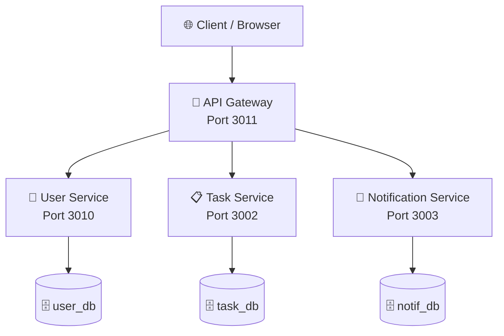

# TaskFlow - Sistem Manajemen Tugas Berbasis Microservices


## 📋 Deskripsi Proyek

**TaskFlow** adalah aplikasi manajemen tugas yang dibangun dengan arsitektur **microservices**. Aplikasi ini memungkinkan pengguna untuk:

- ✅ Registrasi dan login dengan JWT Authentication
- ✅ Membuat, mengedit, menghapus, dan meng-assign tugas
- ✅ Melihat tugas dalam tampilan kalender
- ✅ Notifikasi otomatis saat tugas di-assign
- ✅ Kolaborasi tim dengan fitur assign tugas ke user lain

## 🔗 Repository

https://github.com/vaniamelia12/task-management-microservices

## 🏗️ Arsitektur Sistem
```

## ✨ Fitur Utama

- 🔐 JWT Authentication & Authorization
- 👤 Manajemen Pengguna
- 📋 CRUD Tugas
- 👥 Assign Tugas ke User Lain
- 🔔 Sistem Notifikasi Otomatis
- 📅 Tampilan Kalender Tugas
- 🐳 Docker Containerization
- ⚙️ CI/CD dengan GitHub Actions
- ☁️ Deployment ke Railway

### Teknologi yang Digunakan

| Lapisan | Teknologi |
|---------|-----------|
| **Backend** | Node.js, Express.js |
| **Database** | PostgreSQL (Database per Service) |
| **Authentication** | JWT (JSON Web Token) |
| **Container** | Docker, Docker Compose |
| **CI/CD** | GitHub Actions |
| **Deployment** | Railway |

## 🚀 Cara Menjalankan Proyek (Lokal)

### Prasyarat

- [Docker Desktop](https://www.docker.com/products/docker-desktop/) terinstal
- [Git](https://git-scm.com/) terinstal
- Port 3011, 3010, 3002, 3003, 5432, 5433, dan 5434 tersediaPort 3000, 3001, 3002, 3003, 5432, 5433, 5434 tersedia

### Langkah-langkah

```bash
# 1. Clone repository
git clone https://github.com/vaniamelia12/task-management-microservices.git
cd task-management-microservices

# 2. Jalankan semua service dengan Docker
docker compose up -d --build

# 3. Buat tabel di database (jalankan satu per satu)
docker exec -it user_db psql -U postgres -d user_db -c "CREATE TABLE users (id SERIAL PRIMARY KEY, username VARCHAR(100) NOT NULL, email VARCHAR(255) UNIQUE NOT NULL, password VARCHAR(255) NOT NULL, created_at TIMESTAMP DEFAULT CURRENT_TIMESTAMP);"

docker exec -it task_db psql -U postgres -d task_db -c "CREATE TABLE tasks (id SERIAL PRIMARY KEY, title VARCHAR(255) NOT NULL, description TEXT, status VARCHAR(50) DEFAULT 'pending', assigned_to INTEGER, created_by INTEGER NOT NULL, deadline TIMESTAMP, reminder_sent BOOLEAN DEFAULT FALSE, created_at TIMESTAMP DEFAULT CURRENT_TIMESTAMP, updated_at TIMESTAMP DEFAULT CURRENT_TIMESTAMP);"

docker exec -it notif_db psql -U postgres -d notif_db -c "CREATE TABLE notifications (id SERIAL PRIMARY KEY, user_id INTEGER NOT NULL, title VARCHAR(255) NOT NULL, message TEXT NOT NULL, is_read BOOLEAN DEFAULT FALSE, created_at TIMESTAMP DEFAULT CURRENT_TIMESTAMP);"

# 4. Buka frontend
# Buka file frontend/landing.html di browser
```
### Akses Service

| Service | URL Lokal | URL Railway |
|---------|-----------|-------------|
| API Gateway | `http://localhost:3011/health` | (URL Railway) |
| User Service | `http://localhost:3010/health` | - |
| Task Service | `http://localhost:3002/health` | - |
| Notification Service | `http://localhost:3003/health` | - |

## 📡 API Endpoint

| Method | Endpoint | Keterangan |
|--------|----------|------------|
| POST | `/api/users/register` | Registrasi user baru |
| POST | `/api/users/login` | Login user |
| GET | `/api/users` | Mendapatkan daftar user (untuk assign) |
| GET | `/api/tasks` | Mendapatkan daftar tugas |
| POST | `/api/tasks` | Membuat tugas baru |
| PUT | `/api/tasks/:id` | Mengupdate tugas |
| DELETE | `/api/tasks/:id` | Menghapus tugas |
| GET | `/api/tasks/status/:status` | Filter tugas berdasarkan status |
| GET | `/api/notifications/user/:userId` | Mendapatkan notifikasi user |

## 👥 Tim Pengembang

| Nama | NIM |
|------|-----|
| Defa Augista | 2320506028 |
| Vania Amelia Setya Wijaya | 2330506010 |

## 📚 Dosen Pengampu

Mata Kuliah DevOps - Fakultas Teknik, Universitas Tidar
## 🔄 CI/CD Pipeline

Workflow otomatis akan berjalan setiap kali terdapat push ke branch `main`:

1. Build Docker Image
2. Menjalankan Automated Test
3. Push Image ke Registry
4. Deploy ke Railway

GitHub Actions digunakan untuk mengotomatisasi proses build dan deployment.
## 📄 Lisensi

Project ini dibuat untuk keperluan pembelajaran Mata Kuliah DevOps Universitas Tidar.